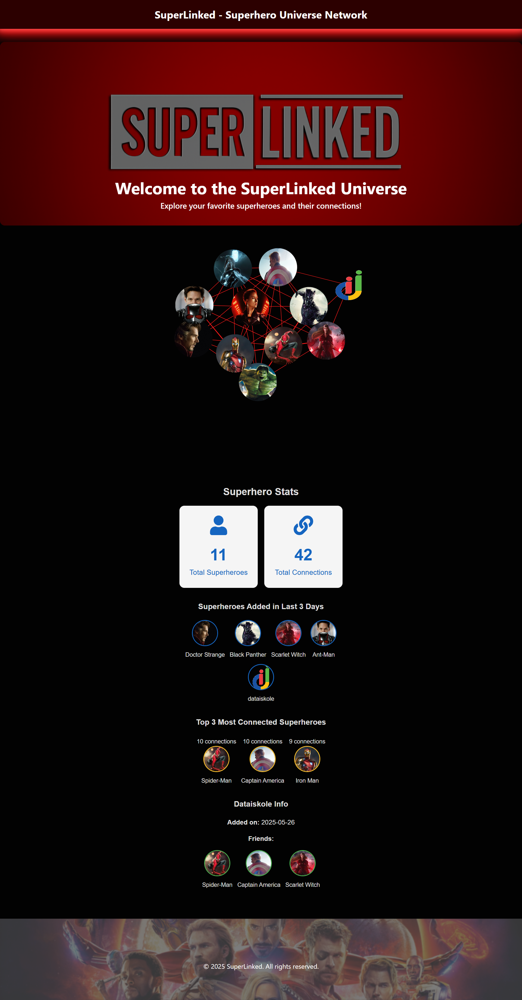

# 🦸‍♂️ SuperLinked — Superhero Universe Network

SuperLinked — Superhero Network A Python-based project that builds and analyzes a superhero friendship network from CSV data. Features include graph analytics, recent additions, and a FastAPI backend serving REST endpoints. Designed for easy integration with interactive frontends.
---


## How to run your code
  -    ### Backend
         **clone the repository**
          1. Navigate to the backend folder:
               ```bash
                  cd Backend
               ```
          2. Activate the Python virtual environment:
             windows
               ```bash
                  .\venv\Scripts\Activate.ps1
               ```
               macOS/Linux 
                ```bash
                 source venv/bin/activate
               ```
          3. Install dependencies:
               ```bash
                 pip install -r requirements.txt
               ```
          4. Run the FastAPI server:
               ```bash
                 uvicorn app:app --reload
               ```
          5. Backend API will be available at:
               ```bash
                http://127.0.0.1:8000
                http://127.0.0.1:8000/docs (for test the end point and server)
               ```
  -    ### Frontend
         **clone the repository**
          1. Navigate to the backend folder:
               ```bash
                  cd Frontend
               ```
          2. Install dependencies:
               ```bash
                  npm install
               ```
          3. Start the React development server:
               ```bash
                  npm run dev
               ```
          5. Open your browser and visit:
               ```bash
                  http://localhost:5173
               ```
## Sample output


## Tools or libraries you used
  - ## 🧰 Tools and Libraries Used

      ### Backend
      - Python 3.12  
      - FastAPI — REST API server  
      - NetworkX — Graph data processing  
      - Uvicorn — ASGI server  
      - pandas — CSV file handling  
      
      ### Frontend
      - React — UI library  
      - Vite — Fast frontend build tool  
      - react-force-graph — Interactive graph visualization  
      - react-icons — Icon set for UI  
      - TypeScript — Static typing  

  - ## ℹ️ Additional Info

      - Images are served from the React frontend public folder and mapped by hero name  
      - Backend serves data via REST endpoints: `/total`, `/top`, `/recent`, `/dataiskole`, `/graph-data`  
      - The graph layout uses a circular spread and force simulation for clarity  
      - The UI includes neumorphic styling for header/footer and animated fade-in sections  
      - Feel free to customize image assets in the `public/assets` folder  

 
----------

#  ❤️  ❤️  ❤️ Happy Coding ❤️  ❤️  ❤️


